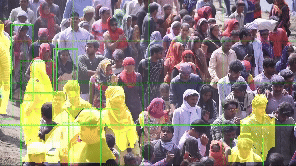

# crowd prevention using yolov8

## Description

crowd-preventionn using Machine Learning is a Project Built with YOLOV8 trained with custom dataset. It aims to provide the real time information about the crowd.



## Features

- count the number of people in crowd
- detect the crowd in real time
- segment the people whos surronded by more people in crowd
- ...

## Installation

To install and run crowd prevention , follow these steps:

1. python 3.11 or higher
2. ```bash
   pip install -r requirements.txt
   ```
3. ```bash
   python app.py
   ```


## License

crowd prevention is licensed under the MIT. For more information, see the [LICENSE](link-to-license-file) file.

## Contact

If you have any questions or suggestions regarding This repository , feel free to contact us at gopal.kmr@yahoo.com.
